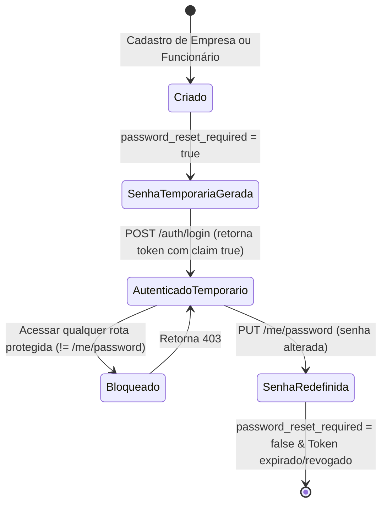

# Especificação Técnica - Feature de Boas-vindas com Senha Temporária

Esta especificação define os contratos de API, invariantes de segurança, máquinas de estado e comportamento técnico para a funcionalidade de geração de senha temporária e primeiro acesso obrigatório.

---

## 1. Contratos de API (Interface Contracts)

### 1.1. Login de Usuário
* **Rota:** `POST /api/v1/auth/login`
* **Content-Type:** `application/json`
* **Requisição:**
  ```json
  {
    "email": "funcionario@empresa.com",
    "password": "SenhaTemporaria123"
  }
  ```
* **Respostas:**
  * **200 OK (Senha temporária ativa):**
    ```json
    {
      "token": "eyJhbGciOiJIUzI1NiIsInR5cCI6IkpXVCJ9...",
      "passwordResetRequired": true
    }
    ```
  * **200 OK (Acesso normal):**
    ```json
    {
      "token": "eyJhbGciOiJIUzI1NiIsInR5cCI6IkpXVCJ9...",
      "passwordResetRequired": false
    }
    ```
  * **401 Unauthorized:** E-mail ou senha incorretos.

### 1.2. Alteração de Senha do Usuário Autenticado
* **Rota:** `PUT /api/v1/me/password`
* **Headers:**
  * `Authorization: Bearer <TOKEN>`
* **Content-Type:** `application/json`
* **Requisição:**
  ```json
  {
    "newPassword": "NovaSenhaSegura123"
  }
  ```
* **Respostas:**
  * **200 OK:** Senha atualizada com sucesso.
    ```json
    {
      "message": "Senha atualizada com sucesso."
    }
    ```
  * **400 Bad Request:** Senha muito curta (menos de 8 caracteres).
    ```json
    {
      "error": "A senha deve ter no mínimo 8 caracteres."
    }
    ```
  * **401 Unauthorized:** Token inválido ou ausente.

---

## 2. Invariantes do Sistema (System Invariants)

1. **Geração Segura:** A senha temporária deve ser composta por exatamente 10 caracteres alfanuméricos gerados de forma criptograficamente segura via `java.security.SecureRandom`.
2. **Isolamento de Segurança (JWT Claim):**
   - O payload do JWT deve conter obrigatoriamente a claim `"passwordResetRequired": true` se o usuário logado tiver a flag ativa no banco de dados.
3. **Filtro Restritivo (API Gateway / Security Filter):**
   - Se o token fornecido possuir a claim `passwordResetRequired: true`, qualquer requisição para endpoints diferentes de `PUT /api/v1/me/password` deve retornar status HTTP `403 Forbidden` imediatamente, sem executar o controller correspondente.
4. **Resignação de Estado:** Ao alterar a senha com sucesso, a coluna `password_reset_required` do respectivo usuário deve ser alterada para `false` atomicamente.

---

## 3. Máquina de Estados do Usuário (User State Machine)

O campo `password_reset_required` e as ações de login/alteração ditam o estado do usuário na aplicação:



---

## 4. Integração com Resend (Serviço de E-mail)

### 4.1. Payload HTTP para Resend
* **URL:** `https://api.resend.com/emails`
* **Headers:**
  * `Authorization: Bearer ${api.resend.key}`
  * `Content-Type: application/json`
* **JSON Payload:**
  ```json
  {
    "from": "Laboris <onboarding@resend.dev>",
    "to": ["destinatario@provedor.com"],
    "subject": "Boas-vindas ao Laboris - Sua Senha Temporária",
    "html": "Olá <strong>Nome</strong>,<br/><br/>Sua conta no Laboris foi criada com sucesso!<br/>Use a senha temporária abaixo para realizar seu primeiro login:<br/><br/><strong>SenhaTemporaria123</strong><br/><br/>Por motivos de segurança, você deverá alterar esta senha no seu primeiro acesso."
  }
  ```

### 4.2. Fallback local para Desenvolvimento
* Caso o parâmetro `api.resend.key` não esteja presente, esteja vazio ou contenha `"mock"`, o serviço **NÃO** realizará a chamada HTTP.
* Em vez disso, o serviço imprimirá no terminal da aplicação uma representação visual clara no formato:
  ```text
  =========================================
  [EMAIL MOCK - RESEND SENDING]
  Para: destinatario@provedor.com
  Assunto: Boas-vindas ao Laboris - Sua Senha Temporária
  Corpo: ...
  =========================================
  ```
